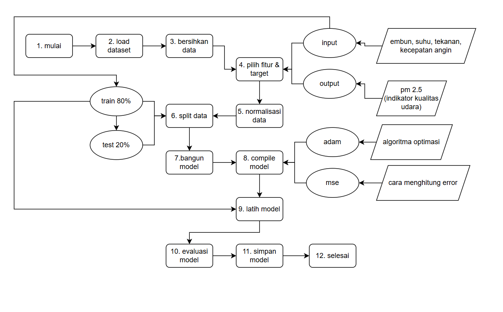

# 🧠 Prediksi Kualitas Udara dengan Deep Learning

## 📌 Apa Itu Deep Learning?

### 🎯 Pengertian singkat:
> Deep Learning adalah teknologi komputer yang meniru cara kerja otak manusia untuk belajar dari data dan membuat prediksi.

### 🧩 Sederhananya:
Bayangkan kamu ingin menebak kualitas udara (PM2.5) hari ini, hanya berdasarkan suhu, angin, embun, dan tekanan udara.  
Manusia bisa menebak dengan logika.  
Nah, deep learning memungkinkan **komputer juga bisa menebak seperti itu** — bahkan lebih akurat!

---

## Cara kerja


---

## ⚙️ Cara Instalasi dan Menjalankan Aplikasi

### 📥 1. Clone Repository
```bash
git clone https://github.com/ebrentinambunan/deep_learning.git
cd deep_learning
```

### 🐍 2. Buat Virtual Environment
```bash
python -m venv venv
```

### ✅ 3. Aktifkan Environment
- **Windows**:
```bash
venv\Scripts\activate
```
- **Linux/macOS**:
```bash
source venv/bin/activate
```

### 📦 4. Install Dependencies
```bash
pip install -r requirements.txt
```

### 📁 5. Struktur Folder Penting
```
project/
├── data/                 # Folder dataset CSV
│   └── PRSA_data_2010.1.1-2014.12.31.csv
├── models/               # Hasil model (.h5, scaler .pkl)
├── main.py               # Training model DL
├── predict.py            # (opsional) prediksi data baru
├── visualize_prediction.py      # Visualisasi hasil prediksi
├── visualize_raw_dataset.py     # Distribusi dan korelasi awal
├── eda_dashboard_pm25.py        # Dashboard Streamlit interaktif
├── .gitignore
└── README.md
```

---

## 🚀 Cara Menjalankan Aplikasi

### ▶ Jalankan Model Training
```bash
python main.py
```

### 📊 Jalankan Visualisasi Dataset Mentah
```bash
python visualize_raw_dataset.py
```

### 📈 Jalankan Visualisasi Hasil Prediksi
```bash
python visualize_prediction.py
```

### 🌐 Jalankan Dashboard Interaktif (Streamlit)
```bash
streamlit run eda_dashboard_pm25.py
```

---

## 📌 Kebutuhan Sistem
- Python 3.10
- Paket: `tensorflow`, `pandas`, `scikit-learn`, `matplotlib`, `seaborn`, `streamlit`

---

## 📬 Kontak
- Pengembang: KELOMPOK 2 - KECERDASAN BUATAN
- Email: bendev403@gmail.com
- Dataset: [UCI Beijing PM2.5 Dataset](https://archive.ics.uci.edu/dataset/381/beijing+pm2+5+data)

---

> Made with ❤️ for belajar Deep Learning dengan data kualitas udara.
